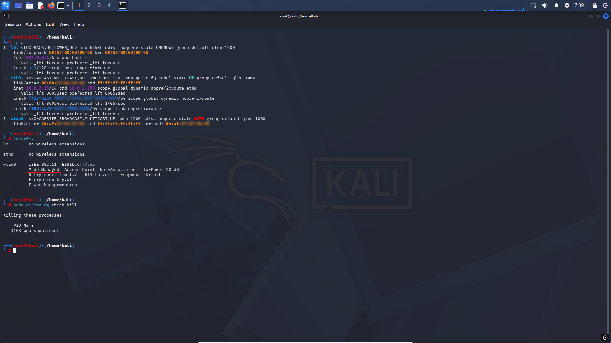
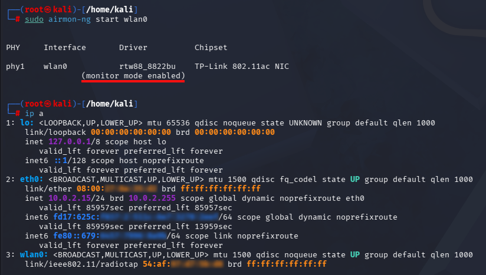
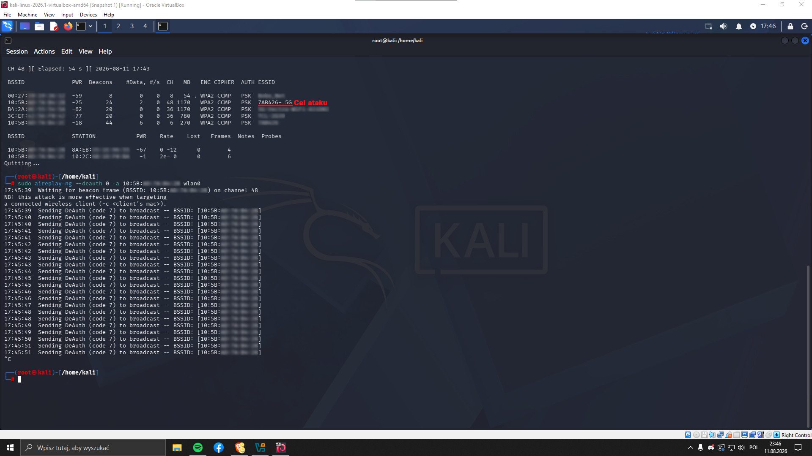
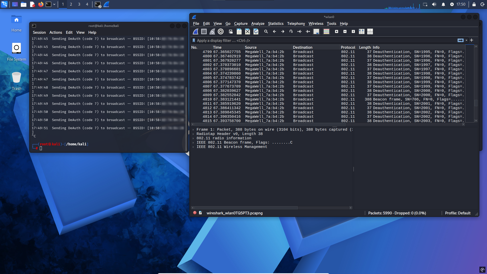
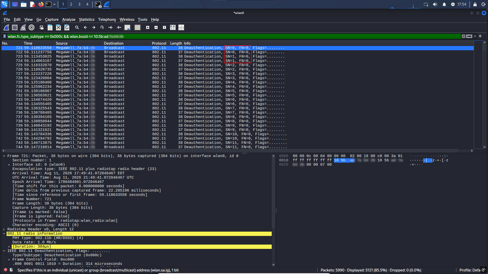
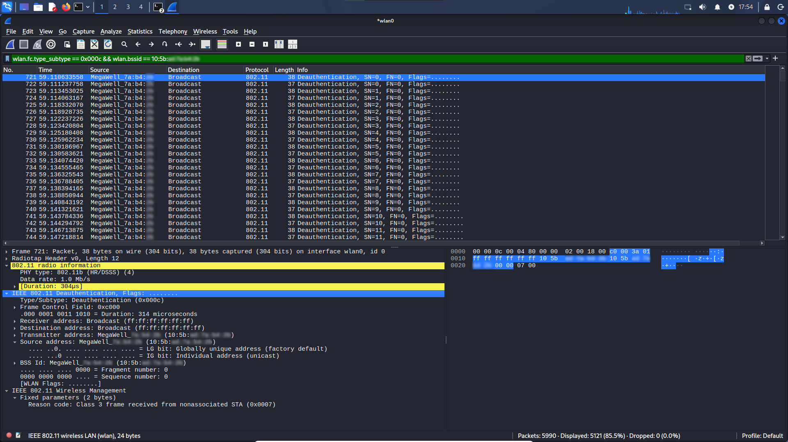
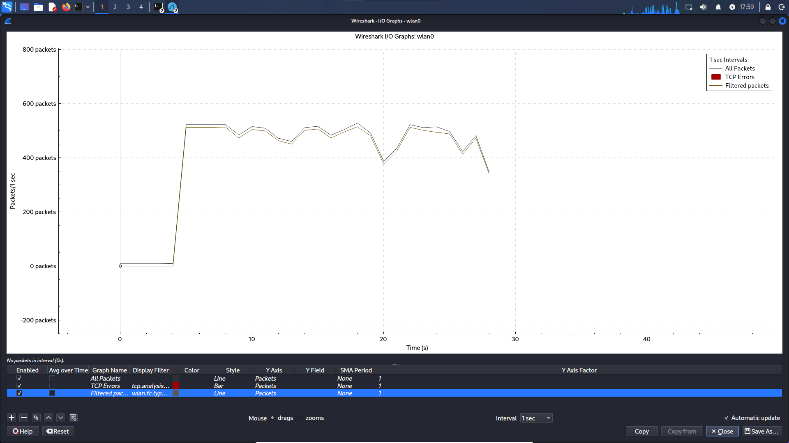

# Atak i analiza deautentykacji Wi-Fi

**Cel projektu:** Symulacja ataku deautentykacji na sieć Wi-Fi oraz szczegółowa analiza przechwyconego ruchu sieciowego. 

Na początku sprawdziłem dostępne interfejsy sieciowe, w tym interfejs zewnętrznej karty sieciowej. Przed przełączeniem karty w monitor mode (tryb nasłuchiwania) zamknąłem działające w tle procesy, które mogłyby zakłócić precyzyjne skanowanie sieci.

> 

Następnie, poleceniem `sudo airmon-ng start wlan0`, uruchomiłem monitor mode w celu nasluchiwania pakietów w eterze. Komendą airodump-ng przeskanowałem otoczenie sieciowe. Gdy zlokalizowałem docelowy BSSID (Mac adres) wybranej sieci, wysłałem pakiety deauth, aby wymusić rozłączenie urządzeń korzystających z tej sieci w danej chwili.

> 
> 

W trakcie trwania ataku uruchomiłem program Wireshark, aby przeanalizować przechwycony ruch. W pasku filtru zastosowałem odpowiednie kryteria wyizolowania ramek deautentykacji. Kluczowym wskaźnikiem potwierdzającym sztuczne wygenerowanie ruchu były numery sekwencyjne SN=0 i SN=1, (w przeciwieństwie do ciągłego, naturalnego narastania licznika lub losowych przeskoków czasowych występujących w ruchu organicznym prawdziwego routera).

> 

> 

> 


W szczegółach ramki (zakładka IEEE 802.11) widoczny jest adres źródłowy. Warto jednak pamiętać, że nie musi to być faktyczny adres fizyczny karty atakującego, ponieważ adres MAC można łatwo zmienić przed rozpoczęciem działań za pomocą poleceń:

```bash
sudo ip link set dev wlan0 down
sudo ip link set dev wlan0 address XX:XX:XX:XX:XX:XX
sudo ip link set dev wlan0 up
```
Na koniec wykorzystałem wykres I/O w Wiresharku, który uargumentował i pokazał nagły skok wysłanych pakietów czyli właśnie atak deautentykacji.
Warto zauważyć, że technika (MAC spoofing) ma znacznie szersze zastosowanie w cyberbezpieczeństwie. Poprzez samo skanowanie eteru, podsłuchanie legalnego adresu MAC innego urządzenia i zmianę go na własnej karcie za pomocą powyższych poleceń, napastnik może całkowicie podszyć się pod cudze urządzenie w sieci lokalnej (L2). Pozwala to m.in. na omijanie filtrowania MAC na routerze, przeprowadzanie ataków typu Man-in-the-Middle (MitM) czy generowanie złośliwego ruchu (np. DDoS), co może skutkować zrzuceniem winy na właściciela sfałszowanego adresu.
> 
